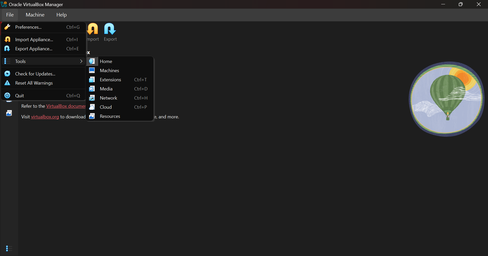
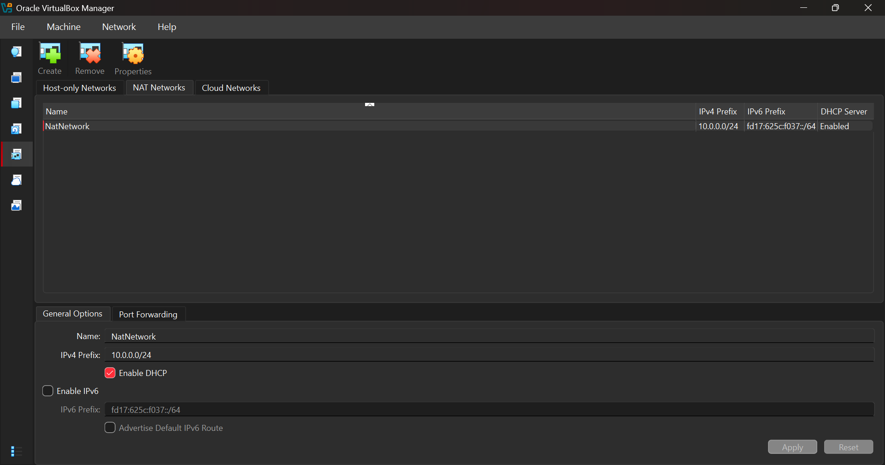
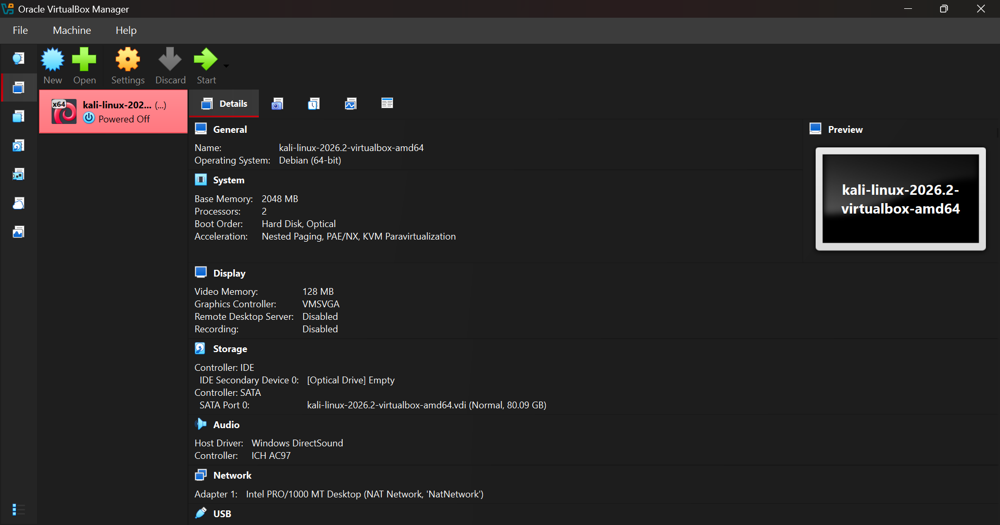
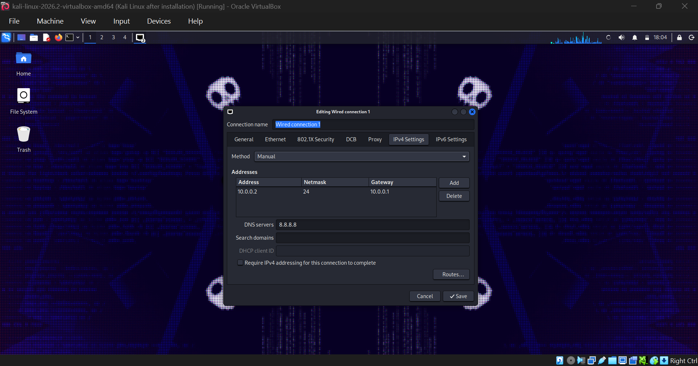
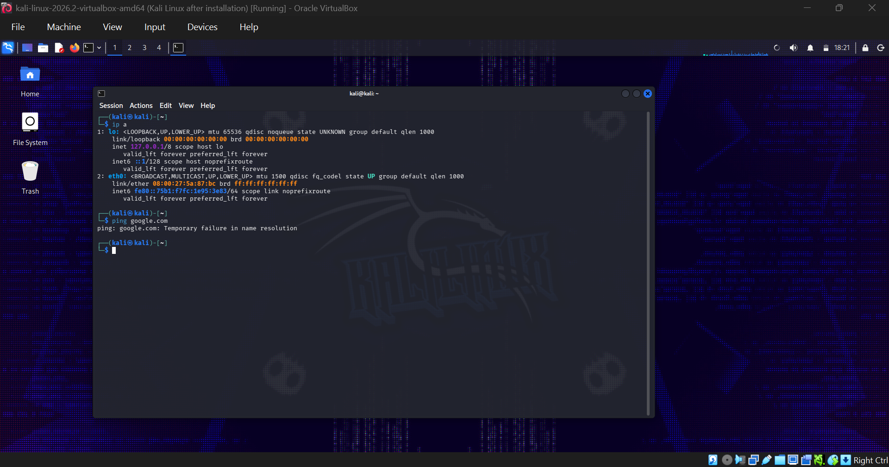
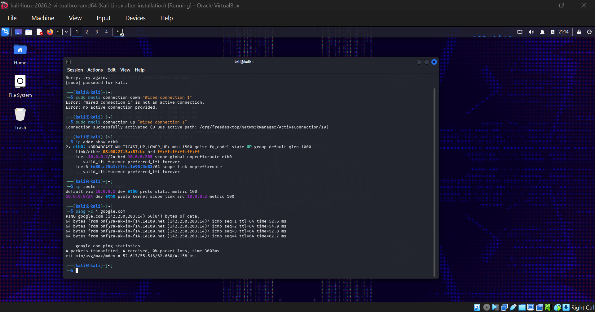
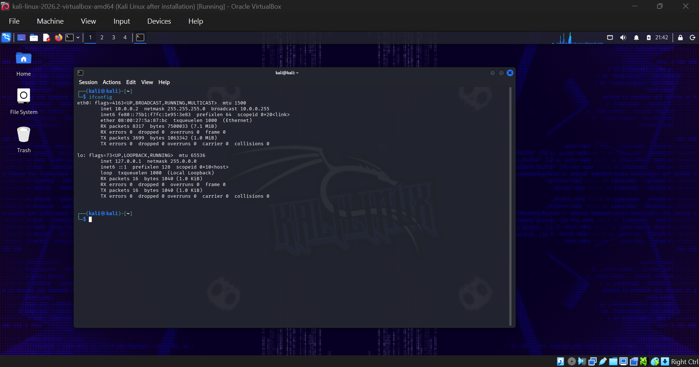
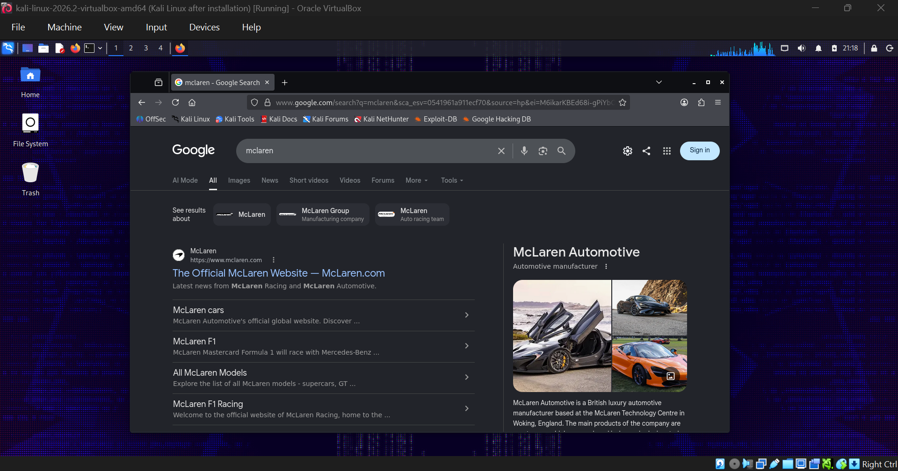
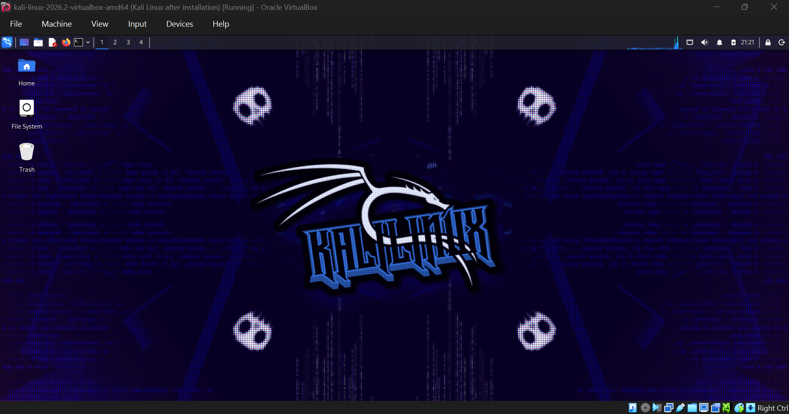

# Cybersecurity Testing Lab Setup — WK1-PM1

**Author:** Noorulain  
**Module:** Week 1 – Project Module 1  
**Task Reference:** Lab Setup for Cyber Security & Ethical Hacking Practice (Networkwalks Academy)

---

## 1. Objective

The goal of this task was to build a self-contained, isolated **Cybersecurity Testing Lab** on my personal laptop using VirtualBox, with Kali Linux configured as the attacking/hacker machine. The key requirements were:

| Requirement | Status |
|---|---|
| VirtualBox installed (latest recommended version) | ✅ Done |
| Kali Linux set up as the attacking machine | ✅ Done |
| Custom **NAT Network** created in subnet `10.0.0.0/24` | ✅ Done |
| Clipboard enabled on the VM | ✅ Done |
| Shared folder (`/downloads`) mapped from host machine | ✅ Done |
| Kali Linux assigned static IP `10.0.0.2/24` | ✅ Done |
| Kali Linux has full internet access | ✅ Done (after troubleshooting — see Section 5) |

---

## 2. Why an Isolated NAT Network?

Rather than using the default NAT adapter or a Bridged connection, I deliberately configured a **custom NAT Network (`NatNetwork`)** inside VirtualBox. The reasoning behind this design choice was to keep the lab **sandboxed**:

- Any malware, exploits, or malicious payloads I create or test inside Kali Linux stay contained within the virtual network.
- My **host operating system remains completely untouched** — even if a VM gets compromised, misconfigured, or infected during hands-on practice, it cannot reach out and affect my actual laptop.
- At the same time, the NAT Network still routes outbound traffic through the host, so the VM keeps full internet access for updates, tool downloads, and CTF practice.

This mirrors real-world penetration testing practice, where an attack lab is always isolated from production/host systems.

---

## 3. Tools & Software Installed

1. **7-Zip** — used to extract the compressed Kali Linux VM appliance files.
2. **Oracle VirtualBox** (latest version) — the hypervisor used to host all virtual machines.
3. **Kali Linux (2026.2, VirtualBox image)** — imported as the primary attacking/hacker VM.

---

## 4. Step-by-Step Setup Process

### Step 1 — Installed 7-Zip
Installed 7-Zip first, since the Kali Linux VirtualBox image is distributed as a compressed archive that needed to be extracted before importing.

### Step 2 — Installed Oracle VirtualBox
Downloaded and installed the latest stable release of VirtualBox on my host machine (Windows).

### Step 3 — Created a Custom NAT Network
I opened **VirtualBox Manager → Tools → Network**, navigated to the **NAT Networks** tab, and created a new network from there. I then modified its settings to create a network named `NatNetwork` with the subnet `10.0.0.0/24` and DHCP enabled, exactly as required by the task.


*Figure 1: Navigating VirtualBox Manager's Tools → Network menu to reach the NAT Networks configuration screen.*


*Figure 2: Custom NAT Network `NatNetwork` created and modified with IPv4 prefix 10.0.0.0/24.*

### Step 4 — Downloaded, Extracted & Imported Kali Linux
Downloaded the official Kali Linux VirtualBox appliance, extracted it with 7-Zip, and imported it into VirtualBox. Once imported, I verified the VM specs (2048 MB RAM, 2 vCPUs, 80 GB SATA disk) and confirmed Adapter 1 was attached to my custom `NatNetwork`.


*Figure 3: Imported Kali Linux VM showing system specs and Network Adapter 1 attached to `NatNetwork`.*

### Step 5 — Enabled Clipboard Sharing & Shared Folder
In the VM settings, I enabled **Bidirectional Shared Clipboard**, and added a shared folder mapping my host's `/Downloads` directory into the Kali VM for easy file transfer between host and guest.

### Step 6 — Configured a Static IP on Kali Linux
Inside Kali, I opened **Network Manager → Wired Connection 1 → IPv4 Settings**, switched the method to **Manual**, and assigned the required static address:

- **Address:** `10.0.0.2`
- **Netmask:** `24` (`255.255.255.0`)
- **Gateway:** `10.0.0.1`
- **DNS:** `8.8.8.8`


*Figure 4: Manual IPv4 configuration on Kali Linux — Address 10.0.0.2/24, Gateway 10.0.0.1.*

---

## 5. Troubleshooting Journey — Internet Connectivity Issue

This part of the setup is worth documenting in detail, since it reflects real troubleshooting rather than a flawless first attempt — and closely matched the known issue flagged in the task guide for VirtualBox v7 / Kali 2026.1+.

### First attempt — it actually worked (but undocumented)
On my very first configuration attempt, the static IP setup applied cleanly and Kali connected to the internet immediately with no errors. Unfortunately, I did not realize at the time that I should capture this for the report, so **no screenshot exists of that first successful run**.

### Second attempt — the issue reappeared
When I later restarted the VM to redo the configuration for documentation purposes, the same static IP setup this time failed to resolve DNS. Running a basic connectivity check showed the interface (`eth0`) was up with the correct IP, but name resolution was broken:

```
ping: google.com: Temporary failure in name resolution
```


*Figure 5: `ip a` confirms `eth0` is UP with a link-local IPv6 address only — no reachable route, and DNS resolution fails.*

This matches a **known bug in newer VirtualBox/Kali releases**, where the network interface doesn't fully bring itself up after a manual IPv4 change, even though the settings are saved correctly.

### The Fix
Following the troubleshooting steps provided in the task's reference guide, I ran the three recommended `nmcli` commands to force the connection to re-negotiate:

```bash
sudo nmcli connection modify "Wired connection 1" ipv4.dad-timeout 0
sudo nmcli connection down "Wired connection 1"
sudo nmcli connection up "Wired connection 1"
```

After running these commands, the interface picked up the correct IPv4 address (`10.0.0.2/24`) along with the default route via `10.0.0.1`, and DNS resolution started working immediately.


*Figure 6: After running the fix commands, `ip addr show eth0` confirms IP `10.0.0.2/24`, `ip route` shows the default gateway, and `ping google.com` succeeds (0% packet loss, ~52–62 ms latency).*

**Takeaway:** This confirmed the importance of understanding *why* a fix works, not just applying it blindly. The `dad-timeout` setting disables IPv6 Duplicate Address Detection delays that were silently blocking the interface from fully activating — a subtle networking detail that's easy to miss without troubleshooting it manually.

---

## 6. Final Verification

With connectivity restored, I re-confirmed every requirement end-to-end:

**IP configuration verified via `ifconfig`:**


*Figure 7: `ifconfig` confirms `eth0` holds IP `10.0.0.2`, netmask `255.255.255.0`, and is actively passing traffic (RX/TX packet counters incrementing).*

**Full internet access verified via browser:**


*Figure 8: Firefox inside Kali successfully loads Google search results, confirming full outbound internet access (not just ICMP/ping).*

**Final desktop confirming a clean, running Kali environment:**


*Figure 9: Kali Linux 2026.2 desktop running successfully inside the isolated NAT Network.*

---

## 7. Summary

| Item | Value |
|---|---|
| Hypervisor | Oracle VirtualBox (latest) |
| Attack VM | Kali Linux 2026.2 (amd64) |
| Network Type | Custom NAT Network (`NatNetwork`) |
| Subnet | `10.0.0.0/24` |
| Kali Static IP | `10.0.0.2/24` |
| Gateway | `10.0.0.1` |
| DNS | `8.8.8.8` |
| Shared Folder | Host `/Downloads` → Kali |
| Clipboard | Bidirectional — Enabled |
| Internet Access | ✅ Confirmed working |

This lab environment is now fully isolated from my host OS, fully networked internally, and fully internet-connected — giving me a safe sandbox to build on in future weeks for hands-on ethical hacking and penetration testing practice.

---

## 8. Lessons Learned

- Always take screenshots **as you go**, not after the fact — the first successful run is proof, too.
- A VM can look "up" (`state UP` on the interface) while still being functionally broken due to IPv6 DAD delays — always test with `ping` and `ip route`, not just `ip a`.
- Known issues documented by an instructor are worth reading *before* panicking — the exact fix was already provided in the lab guide, and understanding *why* it worked was more valuable than just running it.
- Isolating the lab network protects the host system, which is a non-negotiable habit going forward as more offensive tools are introduced.
